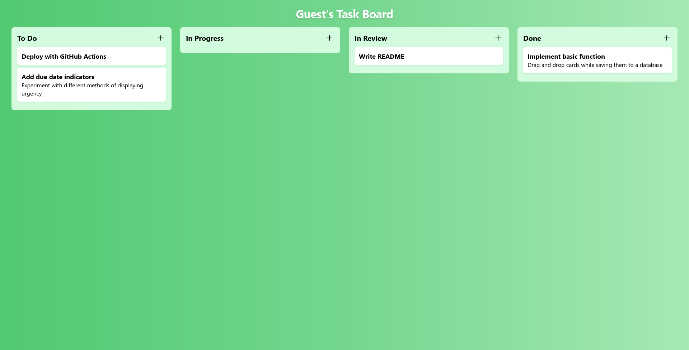
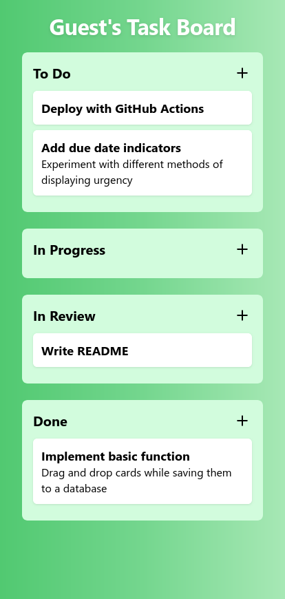

# Task Board
Task Board is a task management app built with React and dnd-kit. Tasks are represented as cards and are dragged between columns to change their status, much like a kanban board. The board's tasks are saved and restored through a Supabase table.

Desktop | Mobile
:------:|:------:
 | 

# Features
- Create tasks
    - Title
    - Description (optional)
- Drag and drop cards between columns
    - Automatically creates "To Do", "In Progress", "In Review", and "Done" columns
- Task persistence
- Responsive layout
    - Columns are displayed horizontally on larger screens in traditional kanban style
    - Columns are displayed vertically on smaller screens to better utilize the limited space

# Getting Started

1. Clone this repository

2. Install dependencies with `npm install`

3. Configure a Supabase table named 'tasks' with the following schema and RLS policies.

    | column_name | data_type                   | is_nullable | column_default    |
    | ----------- | --------------------------- | ----------- | ----------------- |
    | id          | uuid                        | NO          | gen_random_uuid() |
    | title       | text                        | NO          | ''::text          |
    | status      | text                        | NO          | 'todo'::text      |
    | user_id     | uuid                        | NO          | auth.uid()        |
    | created_at  | timestamp without time zone | NO          | now()             |
    | description | text                        | YES         | ''::text          |

    | tablename | policyname                       | permissive | roles    | cmd    | qual                   | with_check             |
    | --------- | -------------------------------- | ---------- | -------- | ------ | ---------------------- | ---------------------- |
    | tasks     | Users can view their own tasks   | PERMISSIVE | {public} | SELECT | (auth.uid() = user_id) | null                   |
    | tasks     | Users can insert their own tasks | PERMISSIVE | {public} | INSERT | null                   | (auth.uid() = user_id) |
    | tasks     | Users can update their own tasks | PERMISSIVE | {public} | UPDATE | (auth.uid() = user_id) | (auth.uid() = user_id) |
    | tasks     | Users can delete their own tasks | PERMISSIVE | {public} | DELETE | (auth.uid() = user_id) | null                   |

4. Create `.env.local` in the project root with the values of your `VITE_SUPABASE_URL` and `VITE_SUPABASE_PUBLISHABLE_KEY`. The [Supabase documentation](https://supabase.com/docs/guides/getting-started/quickstarts/reactjs#6-declare-supabase-environment-variables) can help you locate these. 
    ```sh
    # .env.local example
    VITE_SUPABASE_URL=https://this-is-a-fake-url.supabase.co
    VITE_SUPABASE_PUBLISHABLE_KEY=sb_publishable_long_string_of_letters
    ```

5. Run `npm run dev` to launch the app.

# Development

## Commands
- `npm run dev` launches the development sever locally.
- `npm run lint` lints the codebase.
- `npm run build` builds the project distribution.
- `npm run preview` launches a preview of the distribution locally.

## Tech Stack
- React: UI framework
- TypeScript: type safety
- Supabase: PostgresSQL backend
- Vite: development and building
- ESLint: linting
- dnd-kit: drag and drop React library

## Project Structure
```
.
├── .gitignore
├── .env.local               # Secrets
├── public                   # App assets
│  ├── favicon.svg
│  └── plus.svg
├── screenshots              # Screenshots for the README
│  ├── desktop.png
│  └── mobile.png
├── src                      # App files
│  ├── components            # Reusable TSX components
│  │  ├── Board.tsx
│  │  ├── Card.tsx
│  │  └── Column.tsx
│  ├── css                   # Styling
│  │  ├── global.css
│  │  ├── Board.module.css
│  │  ├── Card.module.css
│  │  └── Column.module.css 
│  ├── lib                   # Support libraries
│  │  ├── auth.ts            # Supabase authentication
│  │  ├── supabase.ts        # Supabase client
│  │  └── types.ts           # Supabase table schema as type
│  ├── main.tsx
│  ├── App.tsx
│  └── vite-env.d.ts
├── eslint.config.js
├── vite.config.js
├── tsconfig.json 
├── package.json
├── package-lock.json 
├── index.html               # App entry point
└── README.md
```


